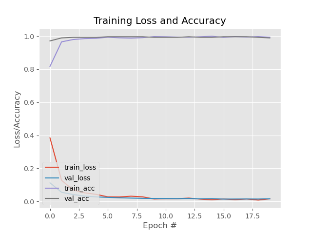
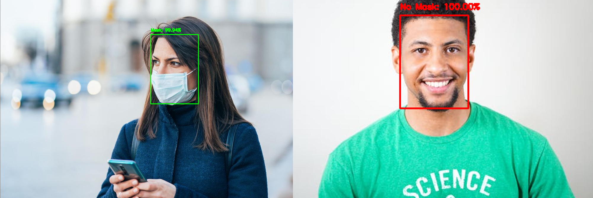

<h1 align="left">
    Face Mask Detector
</h1>

 A COVID-19 face mask detector built with OpenCV, Keras/TensorFlow, and Deep Learning.:relaxed:

<h2> Motivation<span style='font-size:100px;'>&#127775;</span></h2>	
<p>
This project was inspired by seeing others implement their own solutions. Since I had some knowledge in that field, I wanted to try my hands on it also. I'm going to build from <a href="https://github.com/prajnasb/observations">Prajna Bhandry's</a> work. I believe this will go along way to ensure the safety of others when implemented by the medical professionals.
</p>

## Features :gem:
* Dataset
To create the dataset, Prajna had an ingenious solution of:
<p>- Taking normal images of faces.</p>
<p>- Then creating a python script to add face masks by using facial landmarks. You can refer to <a href="https://github.com/prajnasb/observations/tree/master/mask_classifier/Data_Generator">Prajna's GitHub repository</a> to find out how this is done.
(When using an artificial dataset of people wearing masks, the images without masks in the training setcannot be re-used. Non-face mask images images that were not used in the artificial generation process need to be gathered. If not done this way, the model will become heavily biased and fail to generalize well.)</p>

* Trained by fine-tuning the <a href="https://github.com/prajnasb/observations/tree/master/mask_classifier/Data_Generator">MobileNet V2 architecture</a>, a highly efficient architecture that can be applied to embedded devices with limited computational capacity (eg. Raspberry Pi, NVIDIA Jetson Nano, Google Coral ...). 

## Installation :package:
1. Clone the repo
```bash
   $ git clone https://github.com/aibenStunner/face-mask-detector.git
   $ cd face-mask-detector
```
2. Install dependencies
```bash
   $ pip install -r requirements.txt
```

## Usage :computer:
* To build the mask detector model, open up a shell and issue the following command:
```bash
   $ python mask_detector_trainer.py --dataset dataset
```
* Implementing the COVID-19 face mask detector for images with OpenCV
```bash
   $ python detect_mask_image.py --image test_images/test_01.jpeg
```
* Implementing the COVID-19 face mask detector for video stream with OpenCV
```bash
   $ python detect_mask_video.py
```
## Demo :movie_camera:
* COVID-19 face mask detector training accuracy/loss curves demonstrate high accuracy and little signs of overfitting the data:sweat_smile:.



* Mask detection using the COVID-19 face mask detector:smile:.


   
 
 ## Contributing :gift: [](https://github.com/dwyl/esta/issues)
Pull requests are welcome. For major changes, please open an issue first to discuss what you would like to change.
Please make sure to update tests as appropriate.

## Want to talk more??
 If you are interested in helping or have something to suggest or just want to chat with me, you can reach me through the following media .
* Email - ebenezergadri99@gmail.com :e-mail:
* Let's connect on <a href="https://www.linkedin.com/in/thegadri/">LinkedIn.</a> :pushpin:
* I'm on <a href="https://www.hackerrank.com/aiben_">HackerRank</a> too.:relaxed:

## References :book:
* <a href="https://github.com/prajnasb/observations">Prajna's GitHub repository</a>
* <a href="https://arxiv.org/abs/1801.04381">MobileNet V2 architecture</a>
* <a href="http://www.image-net.org/">ImageNet</a>


## Todos :pencil:
* Improve the accuracy of the mask detector. 
The dataset didn't contain example images of people wearing face masks ergo when a large portion of the face is occluded, the face detector might fail to detect the face.
* Apply the model to live camera feeds

License :key:
----

MIT &copy; Gadri Ebenezer

